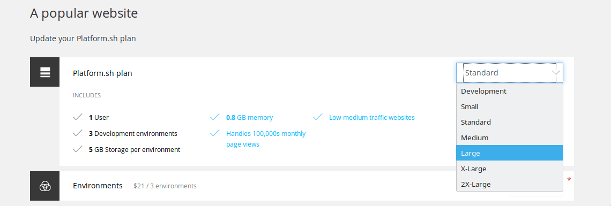
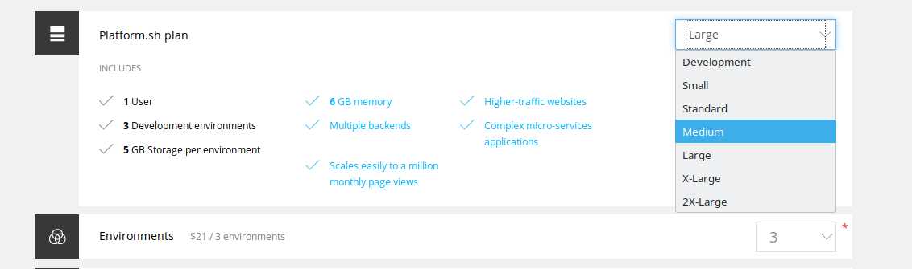

# Scaling on demand

---
> We have a huge sale tomorrow. Traffic is going to skyrocket!

---

That's easy. Just go to your user page\...

---

... Edit the project

---

... And pick a new plan size. Scale as high as you need.
---

The site will redeploy in seconds.

---
5x the memory and CPU are now yours!

---

You can scale back down to any plan size anytime.

Plans are prorated. Pay for only the time you use!

---
<asciinema-player src="assets/6-cli-scale.cast"></asciinema-player>
You can scale from the command line, too.

Including from your own scripts.
---

